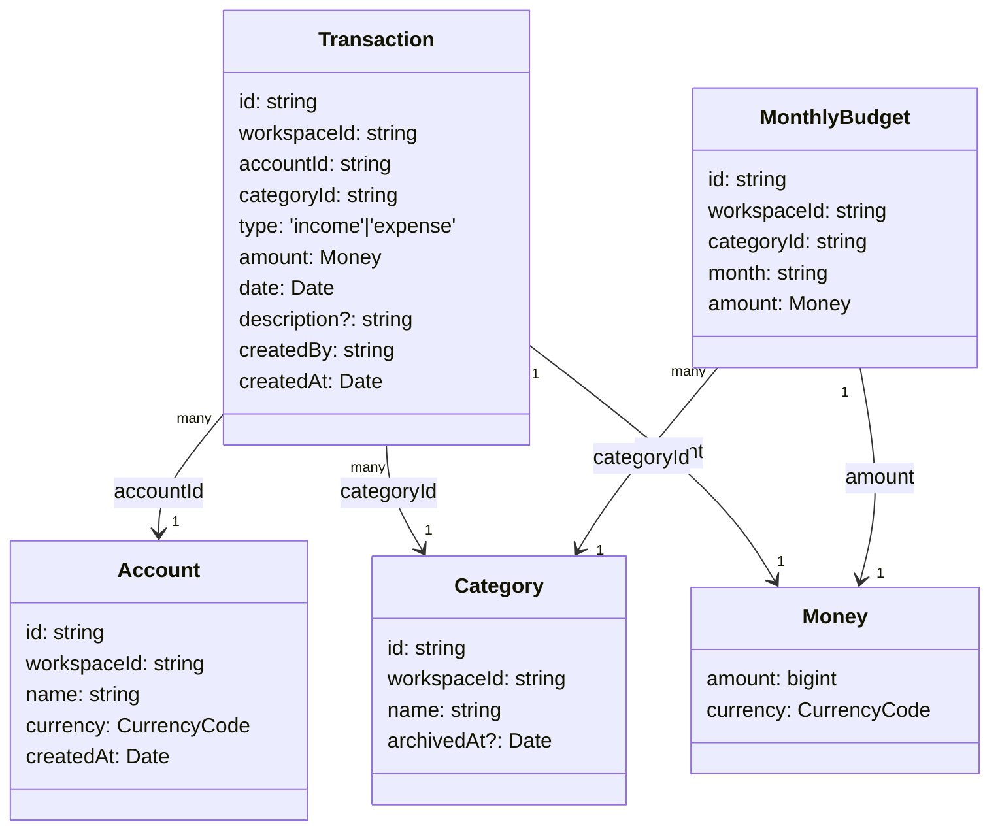

# Penny — Architecture Decision Records

ADR-style records for load-bearing, hard-to-reverse choices. Each record documents the decision, the rationale, and the alternatives considered. Soft rules reference these records.

---

## ADR-001 — Authentication: Telegram Login Widget

**Status:** Accepted

**Decision:** Use the Telegram Login Widget for user authentication. No passwords, no email/password flow.

**Context:** The platform needs an auth mechanism that works for a small family group, avoids password storage, and is low-friction for the target users (who are already Telegram users).

**Rationale:**

- Zero password storage eliminates the most common credential leak vector.
- Telegram manages identity; Penny manages only the `telegramId` as the durable key.
- The HMAC-based payload verification is straightforward to implement and well-documented.
- Not a Mini App or bot deep-link — the Login Widget is the simplest integration point.

**Alternatives rejected:**

- Email/password: requires password hashing, reset flows, and exposes credentials at rest.
- OAuth (Google, GitHub): more moving parts; doesn't match the target user base.
- Passkeys: good long-term but more complex to implement and less familiar to target users.

**Consequences:**

- The backend must verify the Telegram HMAC on every login (see `rules/validation-authorization.md`).
- `auth_date` freshness check (reject > 24 h) is mandatory to prevent replay attacks.
- The Login Widget requires a real HTTPS domain for production; localhost has limitations.

---

## ADR-002 — Database: MongoDB + Mongoose/Typegoose

**Status:** Accepted

**Decision:** Use MongoDB as the primary database, accessed via Mongoose with Typegoose decorators, confined entirely to the `type:infrastructure` layer behind repository interfaces.

**Context:** The platform will grow to cover heterogeneous verticals (budget, car, family services) with different data shapes.

**Rationale:**

- Schema flexibility across dissimilar verticals without upfront migrations for every shape change.
- MongoDB aggregation pipeline for analytics-style queries (budget history, charts).
- The onion architecture isolates the DB choice behind repository interfaces, making it low-regret.

**Alternatives rejected:**

- Prisma + PostgreSQL: Prisma's Mongo driver lacks the aggregation pipeline support and has no native migration system for Mongo — removes the main benefit of choosing Mongo.
- MikroORM: managed entities conflict with the framework-free `type:core` requirement (entities must remain plain TypeScript classes).
- TypeORM: mature but mixing ORM concerns into domain entities violates the clean architecture goal.

**Consequences:**

- Money values must be stored as integer minor units or `Decimal128` — never IEEE 754 float.
- Cross-collection invariants require multi-document transactions.
- Typegoose schema + mapper functions are strictly in `type:infrastructure`; domain entities in `type:core` are plain TypeScript classes with no ORM decorators.

---

## ADR-003 — Architecture: Onion / Clean Architecture + Vertical Slices

**Status:** Accepted

**Decision:** Organize the codebase as domain-first vertical slices (`libs/<domain>/`) each containing the full onion stack (core → application → infrastructure → transport), with `libs/shared/` for cross-cutting code.

**Context:** The platform will be AI-orchestrated, with multiple agents generating code in parallel. Architectural boundaries must be machine-enforceable, not just documented.

**Rationale:**

- Framework-agnostic core and application layers are independently testable without starting NestJS.
- Vertical slices prevent domain concepts leaking across bounded contexts.
- Nx tag boundaries (`scope:` × `type:` × `platform:`) are machine-enforced by ESLint — an "architecture as an executable contract" that survives AI-generated code at scale.
- The transport-agnostic service pattern means the same application service runs in the HTTP API and the CLI without modification.

**Alternatives rejected:**

- Feature-folder (everything for a feature in one place, mixed layers): easier to start but collapses layer boundaries over time; harder to enforce with tools.
- Microservices: no operational-maturity pressure, no team; distribute only if forced later.

**Consequences:**

- Application services (`type:application`) must never contain `@Injectable()` or any framework import.
- NestJS DI wiring lives only in `apps/api` / `apps/cli` (the transport layer).
- Every new vertical copies the `libs/identity/` shape: `{core,application,infrastructure,feature-*,data-access}`.

---

## ADR-004 — Dependency Management: Exact Pins, No Ranges

**Status:** Accepted

**Decision:** All `package.json` dependencies (direct, dev, peer) are pinned to exact versions — no `^` or `~` ranges. Renovate handles upgrades via grouped PRs with CI gate and manual review.

**Context:** Supply-chain attacks via npm dependency confusion and malicious version bumps are a real and growing risk.

**Rationale:**

- Exact pins + committed `pnpm-lock.yaml` + `pnpm install --frozen-lockfile` in CI mean every transitive dependency is content-hashed and auditable.
- Renovate `minimumReleaseAge` (≥ 7 d) adds a cooldown before picking up new releases, avoiding zero-day-poisoned packages.
- `pnpm` default-denies install scripts (the dominant supply-chain vector); explicit allowlist required.

**Alternatives rejected:**

- Semver ranges: convenient but mean "whatever was on npm when I installed" — not reproducible.
- Dependabot: no `rangeStrategy: pin` equivalent; generates noisier PRs with less grouping control.

**Consequences:**

- `npm ci` / `pnpm install` always produce the exact lockfile-pinned tree.
- CI script greps `package.json` for `^` / `~` and fails the build if found.
- After every `pnpm add` or generator run, run `pnpm dedupe` and audit the lockfile diff.

---

## ADR-005 — Module Resolution: `bundler` + `.js` Backend Extensions

**Status:** Accepted

**Decision:** Use `moduleResolution: "bundler"` uniformly across the monorepo. Enforce `.js` extensions on relative imports in backend code only (via ESLint), leaving Angular imports extension-free.

**Context:** The monorepo targets two different bundlers: webpack (NestJS API/CLI) and esbuild (Angular). TypeScript's `nodenext` resolution requires `.js` extensions everywhere but conflicts with NestJS-ESM and Angular's bundler resolver.

**Rationale:**

- `bundler` resolver avoids the NestJS-ESM/SWC TS1479 conflict.
- `.js` extension enforcement on backend code (`apps/api/**`, `apps/cli/**`, `libs/**/core/**`, etc.) means a later switch to `nodenext` for standalone lib publishing is low-friction.
- Angular's module resolution is handled by the Angular compiler and esbuild — no extensions needed.

**Enforcement:**

- ESLint `no-restricted-syntax` rule in `eslint.config.mjs` applies the `.js` extension check only to backend file globs (`apps/api/**`, `apps/cli/**`, backend `libs/**`). This is a **hard fuse**.

**Alternatives rejected:**

- `nodenext` everywhere: reopens TS1479 (NestJS-ESM/SWC conflict).
- `node16`: deprecated alias for `nodenext`; same conflict.
- ESM + SWC end-to-end: no actual runtime conflict (apps are webpack-bundled), but adds config complexity with no benefit at the current scale.

---

## ADR-006 — CSP Nonce Delivery

**Status:** Accepted and implemented.

**Context:** Angular's runtime `<style>` injection requires either `style-src 'unsafe-inline'` or a per-request CSP nonce embedded in `index.html`. Nonce delivery requires the process that serves `index.html` to generate and inject the nonce value on every request — which process does that depends on the serving topology.

The serving topology settled on **nginx serves `index.html`** (`apps/web` container), not NestJS. The API container has no host port and never touches the HTML.

**Decision — Option B (nginx serves HTML):** Per-request nonce injection is implemented at the nginx layer (`apps/web/nginx.conf`):

- nginx generates a per-request nonce from its built-in `$request_id` variable (a 128-bit CSPRNG value, rendered as 32 hex characters) — no custom nonce-generation module needed.
- The Angular build embeds a placeholder (`<meta name="csp-nonce" content="">` in `index.html`, wired to Angular's `CSP_NONCE` DI token in `apps/web/src/app/app.config.ts`) that `sub_filter` replaces with the live nonce value at request time.
- nginx sets the `Content-Security-Policy` response header with `style-src 'self' 'nonce-$request_id'` (plus a `sha256-` hash for Angular's own emulated-encapsulation style block).
- `gzip off` is set on the same location block, since a compressed response would otherwise bypass `sub_filter` silently.
- `apps/api/src/middleware/csp-policy.ts` (NestJS Helmet CSP for JSON API responses) emits `style-src 'self'` with no `'unsafe-inline'` — the API never serves HTML, so it needs no nonce.

**Alternatives rejected:**

- Option A (NestJS serves HTML via `ServeStaticModule`): would place static-file serving and HMAC auth logic in the same process, complicating health checks and adding latency for all static asset requests. Rejected once the nginx serving topology was chosen.
- `'unsafe-inline'` permanently: permits injected stylesheets from XSS — rejected as a permanent posture; only used as a time-bounded interim tradeoff before the nonce pipeline shipped.

**Consequences:**

- Any new Angular build must keep emitting the `csp-nonce` meta placeholder in `index.html`, or `sub_filter` has nothing to replace and the nonce falls back to the un-replaced placeholder value.
- The nginx container image must have `ngx_http_sub_module` compiled in (present in the official `nginx:*-alpine` images).
- The hardcoded `sha256-...` hash in `apps/web/nginx.conf` for Angular's own style block must be regenerated (from the browser's CSP violation console, or by extracting the built stylesheet) whenever `nx build web`'s output for that block changes.

---

## ADR-007 — Budget Domain: Entities, Aggregates, and Scoping

**Status:** Accepted

**Date:** 2026-07-19

**Context:** The budget application is migrating from a legacy monolithic model (`Bill` singleton, numeric category FKs, date strings) to a domain-driven workspace-scoped model. The planning team (ba + ddd-architect + devil) resolved all 10 key design decisions, confirmed compatibility with the parked Workspace feature, and ratified provisional entity names.

**Decision:** The budget bounded context defines four aggregates (`Account`, `Category`, `Transaction`, `MonthlyBudget`), all workspace-scoped, with immutable entities following onion architecture (plain TypeScript classes in `core`, no ORM or framework imports). Balance is derived from transaction aggregation. Categories support soft-archive semantics. Transactions carry an explicit sign via `type: 'income' | 'expense'` (stored in `budget/contracts`, not shared). All aggregates reside in `libs/budget/*` scope, mirroring `identity`'s template shape: core, application, infrastructure, feature-\*, ui, data-access.

### Entities and Invariants

**Account (aggregate root)**

```ts
{
  id: string;
  workspaceId: string;
  name: string;
  currency: CurrencyCode; // 'UAH' in MVP
  createdAt: Date;
}
```

- Immutable class in `libs/budget/core` with a static `create(id, workspaceId, name, currency, now)` factory.
- No stored balance field — balance is derived as `Σ(income) − Σ(expense)` via aggregation over all workspace transactions attributed to this account.
- `archivedAt` omitted at MVP (single seeded default account); additive later as a soft-delete flag.
- Mutators (if added later) return new instances, never mutate in place.
- Invariant breaches throw `DomainError`.

**Category (aggregate root)**

```ts
{
  id: string
  workspaceId: string
  name: string
  archivedAt?: Date  // soft-delete
}
```

- **Type-agnostic tag:** no `income` / `expense` field. Categories apply semantically at the `MonthlyBudget` level (budgets apply to expense only); transactions tag-reference categories freely (both income and expense transactions can cite the same category — classification is up to the user).
- `capacity` field removed entirely (moved to per-month, per-category `MonthlyBudget`).
- Name unique per workspace, case-insensitive, among **non-archived only** (the constraint is `UNIQUE {workspaceId:1, name:1}` with partial filter + collation).
- One-way soft-archive: `archive(reason?)` sets `archivedAt`, throws if already archived. Unarchive is deferred (additive later).
- Archived categories remain on historical transactions as-is; the archived status hides them from "create transaction" / "set budget" selection UI only, never from historical aggregations (`sumExpenseByCategory` includes archived tags).
- Renaming an archived category is blocked, not just delete-blocked: `UpdateCategoryService` rejects the rename with `DomainError.conflict` before the collision check runs, since an archived tag is a closed record, not an editable one.
- Owner UX note: the History screen may highlight an archived/stale category on a past transaction to suggest re-tagging — a presentation affordance, not a domain rule.

**Transaction (aggregate root)**

```ts
{
  id: string
  workspaceId: string
  accountId: string  // REQUIRED (attributed to account for per-account balance)
  categoryId: string  // REQUIRED (tagged for analytics)
  type: TransactionType  // 'income' | 'expense'
  amount: Money  // positive minor units + currency
  date: Date  // economic date (transaction month attribution)
  description?: string  // optional note
  createdBy: string  // userId (audit trail)
  createdAt: Date
}
```

- `amount` is **always positive**; sign is conveyed by `type`, never a negative amount.
- `date` is the economic date (e.g., purchase date) and drives month attribution for `MonthlyBudget` calculations.
- **Editable + deletable (deferred to Q5):** immutable at MVP; an edit/delete path will arrive in a later phase.
- `createdBy` populated from `context.caller.userId` at the API/CLI boundary.
- No lifecycle/state machine — transactions have no status transitions.

**MonthlyBudget (aggregate root)**

```ts
{
  id: string;
  workspaceId: string;
  categoryId: string;
  month: string; // 'YYYY-MM' format
  amount: Money; // positive minor units + currency
}
```

- Unique per `(workspaceId, categoryId, month)` — only one budget per category per month.
- Month attribution: the `month` field is a fixed string `'YYYY-MM'`; a transaction is included in the budget via its `date` calendar month **in the Europe/Kyiv timezone** (no TZ math in the pipeline — computed once in the application layer at the boundary, yielded as a half-open UTC instant range; the repo stays agnostic).
- **Applies to expense only** — MonthlyBudget amounts are ceiling targets for spending. Income transactions are never compared to a budget.
- **Any category may be budgeted** — no validation restricts which categories are budgetable (free-form MVP risk accepted by owner, Q3 addendum).
- No lifecycle — budgets exist, are upserted, or deleted; no approval/draft states.

**TransactionType (const export from `libs/budget/contracts`)**

```ts
export const TransactionType = {
  INCOME: 'income',
  EXPENSE: 'expense',
} as const;
```

Placed in `libs/budget/contracts`, not `shared/contracts`, because budget DTOs are domain-specific. Kept as an `as const` object (not an enum) per code-style conventions.

### Design Decisions

**1. Names ratified unchanged**

Ratified: `Account`, `Category`, `Transaction`, `MonthlyBudget`; type literal `'income' | 'expense'` (not legacy `'outcome'`).

Rejected alternatives: `Record` (collides with TypeScript's `Record<>` utility type — actively harmful), `Entry` (vaguer), legacy `outcome` (non-idiomatic). Renaming after the budget contracts and DTOs ship is expensive; changed now while the design is still fluid.

**2. Workspace scoping**

Every budget document carries `workspaceId: string`; repository interfaces take `workspaceId` as a first-class parameter. All aggregates reference workspaces by identity only — budget imports nothing from a future `scope:workspace` lib. This identity-only reference design is compatible with future workspace-scoped authorization: when workspace-membership authorization is added later, only the boundary constant (`DEFAULT_WORKSPACE_ID` location) changes — additive, zero budget-schema change. MVP authorization is `context.caller` active-status only; workspace-membership authorization is the additive seam (no new domain code).

**3. Balance is derived**

Balance = aggregation over transactions: `Σ(income) − Σ(expense)` per account/workspace. Concurrency story: no stored balance field ⇒ no read-modify-write race ⇒ no compare-and-swap needed. Inserts are append-only; balance is always recomputed from the authoritative transaction set. No multi-document MongoDB transactions needed at MVP (standalone compose mongo lacks them; budget has no cross-collection money moves). Scale path: a materialized `AccountBalanceSnapshot` served behind the same repo method later — callers unchanged, not a rearchitecture.

Rejected: stored balance + CAS updates (unnecessary race surface; unsafe across collections without transactions).

**4. Transaction requires accountId**

`accountId` is a REQUIRED field now, attributed for per-account derived balance math. Single seeded account in MVP; multi-account support additive later (no backfill when it ships). Defaulted to the seeded account at the API/CLI boundary, never in the core aggregate.

**5. MonthlyBudget month semantics are permanent**

"Monthly" is baked into both the entity name and the `'YYYY-MM'` field format — future non-monthly periods (weekly, yearly, savings goals) will be new aggregates, not field additions to `MonthlyBudget`. Budgets apply to **expense only**; income transactions are never checked against a budget.

**6. Category soft-archive, never hard delete**

`archive()` sets `archivedAt`, making the category hidden from UI selections but preserved on historical transactions. Hard delete is forbidden (owner decision Q4) — the historical tag survives. Archived categories remain in aggregation queries (`sumExpenseByCategory`, `sumAmountsByType`); archive hides a category from _selection_ UI only, never from historical math. A future presentation affordance (History screen may highlight archived/stale tags) is a rendering detail, not a domain rule.

**7. "Amount ≤ balance" rule dropped**

Expense creation never validates that remaining balance is sufficient — a family legitimately overspends or goes negative. A soft UI warning is deferred; MVP accepts the owner's "users manage their own discipline" posture.

**8. Money storage: integer minor units via Mongoose BigInt**

The shared `Money` value object (minor units + currency) is stored as **Mongoose-native `BigInt` SchemaType → BSON int64** (`@prop({ type: () => BigInt })`), round-tripping `bigint ↔ Long`, no float, `$sum`-compatible, zero new dependencies. Fallback (only if the pinned Mongoose/Typegoose versions' BigInt support proves unreliable): BSON `Decimal128` storing the integer value via string. The `Money.toJSON()` transport form (string `amount`) is transport-only — the string must NOT be stored in the database (breaks `$sum` aggregation).

Standing rule: a spike at the **start of the schema implementation** verifies BigInt+`$sum` support via context7 against the pinned versions; low-regret switch to Decimal128 if needed (only infrastructure serialization changes, not contracts).

Rejected: IEEE 754 `double` (violates the Money-never-float fuse), `int32` (overflows at ~21M UAH), stored string (breaks aggregation).

**9. No state machine**

Transaction and MonthlyBudget have no lifecycle — they exist in a single "stable" state. Category's active/archived is a 2-state soft-delete flag, not a workflow. Recorded explicitly so it isn't re-litigated in a future phase.

**10. Contracts and validation in budget scope**

`libs/budget/contracts` (DTOs, `TransactionType`, `DEFAULT_WORKSPACE_ID`) and `libs/budget/validation` (LIVR schemas) are **not** in `shared/contracts/validation`. Rationale: shared libraries should contain only cross-cutting code that is isomorphic across platforms (server/client/CLI), whereas budget DTOs are domain-specific. Nx tag machinery natively supports domain `type:contracts`/`type:validation`; keeps the vertical slice self-contained. Identity's earlier precedent (contracts in shared) is a skeleton-phase artifact superseded once multiple domains exist. The validation lib's fuse is strict: `type:validation` may depend ONLY on `type:util` — LIVR schemas are self-contained runtime objects, never importing contract TS types.

**`DEFAULT_WORKSPACE_ID`** lives in `libs/budget/contracts`, applied **ONLY at the API/CLI boundary** to stamp `workspaceId` on inbound requests; core/application never import it. A TODO marks its swap point when workspace-scoped multitenancy is implemented.

### Repository Interfaces

Base `IRepository<T, string>` pattern: `findById`, `save` (create-only; `id === ''` is a signal to the infra layer to generate it), `delete`.

**IAccountRepository**

- `findByWorkspace(workspaceId): Promise<Account[]>`
- `findByIdInWorkspace(id, workspaceId): Promise<Account | null>`

**ICategoryRepository**

- `findByWorkspace(workspaceId, includeArchived?: false): Promise<Category[]>`
- `findByIdInWorkspace(id, workspaceId): Promise<Category | null>`
- `findByNameInWorkspace(name, workspaceId): Promise<Category | null>` (case-insensitive, non-archived only — uniqueness check helper)
- `archive(id, workspaceId): Promise<void>`

**ITransactionRepository**

- `findByWorkspace(workspaceId, filter?: {type?, categoryId?, accountId?, from?: Date, to?: Date}): Promise<Transaction[]>`
- `findByIdInWorkspace(id, workspaceId): Promise<Transaction | null>`
- `existsForCategory(categoryId, workspaceId): Promise<boolean>` (used in archive-validation)
- `updateInWorkspace(id, workspaceId, fields): Promise<void>` (deferred to Q5 edit phase)
- `deleteInWorkspace(id, workspaceId): Promise<void>` (deferred to Q5)
- `sumAmountsByType(workspaceId, filter?: {accountId?, from?, to?}): Promise<{income: bigint, expense: bigint}>` (balance derivation)
- `sumExpenseByCategory(workspaceId, filter?: {from?, to?}): Promise<Array<{categoryId, total: bigint}>>` (chart data)

Aggregation methods return **bigint minor units** — the application layer constructs `Money(account.currency)` from them (keeps Money construction above infrastructure).

**IMonthlyBudgetRepository**

- `findByWorkspaceAndMonth(workspaceId, month: 'YYYY-MM'): Promise<MonthlyBudget[]>`
- `findByWorkspaceCategoryMonth(workspaceId, categoryId, month): Promise<MonthlyBudget | null>`
- `upsertAmount(workspaceId, categoryId, month, amount: Money): Promise<void>`

### Database Indexes

- **accounts**: `{workspaceId:1}`
- **categories**: UNIQUE `{workspaceId:1, name:1}` (case-insensitive collation, strength:2) + `partialFilterExpression: {archivedAt: null}` (uniqueness only among non-archived); query index `{workspaceId:1, archivedAt:1}`
- **transactions**: `{workspaceId:1, accountId:1, type:1}` (balance), `{workspaceId:1, date:-1}` (history/period), `{workspaceId:1, categoryId:1, date:1}` (planner/pie/existsForCategory)
- **monthlyBudgets**: UNIQUE `{workspaceId:1, categoryId:1, month:1}` + query index `{workspaceId:1, month:1}` (planner month view)

### Month Attribution

No timezone math in the pipeline. The application layer converts `'YYYY-MM' + Europe/Kyiv` → a half-open UTC instant range `[fromInstant, toInstant)` (recommend a `budget/core` value object `Month.toInstantRange(tz)` using a pinned `Intl` or `date-fns-tz`, confined to that one VO), passes plain `Date` instants to the repo. The pipeline stays timezone-agnostic and compares stored UTC `date` against the instant range. Handles Kyiv DST edges correctly because the boundary is computed once in the app layer, not per-document in the DB.

### Canonical `libs/budget/*` Layout

Identity's real shape is authoritative (supersedes the roadmap's provisional shorthand):

```
libs/budget/
  core/            scope:budget type:core           platform:server
  contracts/       scope:budget type:contracts      platform:shared
  validation/      scope:budget type:validation     platform:shared
  application/     scope:budget type:application    platform:server
  infrastructure/  scope:budget type:infrastructure platform:server
  data-access/     scope:budget type:data           platform:web
  ui/              scope:budget type:ui             platform:web
  feature-account/ scope:budget type:feature        platform:web
  feature-records/ scope:budget type:feature        platform:web
  feature-history/ scope:budget type:feature        platform:web
  feature-planner/ scope:budget type:feature        platform:web
```

**ESLint configuration prerequisite:** add `{ sourceTag: 'scope:budget', onlyDependOnLibsWithTags: ['scope:budget','scope:shared'] }` to `eslint.config.mjs` (currently only `scope:shared`/`scope:identity` are enumerated) — an unfenced source tag can import anything. This configuration change must be made before budget library implementation begins to enforce the scope boundary.

### Budget Domain Diagram



### Devil Sign-Off

**DEVIL SIGN-OFF:** No blocking objections. Accepts all ba/ddd resolutions including both overrides (TransactionType in budget/contracts; Mongoose-native-BigInt with Decimal128 fallback). Escalated one item — the category-type/budget-eligibility question — now resolved by the owner (type-agnostic tag, no eligibility validation, free-form MVP risk consciously accepted). Non-blocking clarifications folded into this ADR: archived-category aggregation, monthly-name permanence, BigInt-storage verification spike at the schema implementation start.

---

## ADR-008 — CSS Framework: Tailwind CSS v4

**Status:** Accepted

**Date:** 2026-07-19

**Decision:** Use Tailwind CSS v4 (utility-first, CSS-first config) for `apps/web` styling. Angular CDK primitives (menu, overlay, dialog, focus-trap) supply behavior for anything Bootstrap components would have covered; Tailwind classes supply the styling. This task records the decision and the design-token seam; it does not install Tailwind — the web-shell mobile-first restyle work installs Tailwind against this ADR.

**Context:** `apps/web` is mid-rebuild (mobile-first, agent-written UI) with only unstyled skeleton pages. The prior legacy app used Bootstrap 5 + ng-bootstrap; the `master:design/` mockups are desktop-oriented and reused only loosely in the new mobile-first design. Owner confirmed the decision 2026-07-16 ("lets use tailwind in this migration, agree") after reviewing a Tailwind-vs-Bootstrap comparison.

**Rationale:**

- **Framework-decoupled upgrades.** ng-bootstrap has historically lagged Angular majors, creating friction with the Renovate/`nx migrate` discipline (see ADR-004; this repo's exact-pin and `nx migrate` discipline for major-version upgrades). Tailwind ships CSS utilities with no Angular-version coupling.
- **Agent-codegen-friendly.** Most UI implementation in this migration is agent-written. Utility classes are self-contained per template (no cross-file theme/SCSS coordination needed to style a single component correctly), which suits AI-generated markup better than a component-class-based framework.
- **Low mockup reuse.** The mobile-first redesign reuses little of the Bootstrap-era `master:design/` mockups, so there is no meaningful sunk cost in staying on Bootstrap for continuity.

**Alternatives rejected:**

- **Bootstrap 5 + ng-bootstrap.** Honest upside: 3–4 ready-made components (modal, dropdown, progressbar) and continuity with the `master:design/` mockups. Rejected because that upside is narrow — Angular CDK primitives (`@angular/cdk/overlay`, `@angular/cdk/menu`, `@angular/cdk/a11y`) plus Tailwind utility classes cover the same behavior, and the version-lag friction (ADR-004's exact-pin/Renovate discipline) outweighs the convenience for a small, greenfield-styled shell.

**Revisit triggers:**

- Component-library needs grow past what CDK primitives + Tailwind utilities comfortably cover (e.g., a data-grid, a rich date-picker, or a design system with many themed variants) — reconsider a headless component library (e.g., Angular CDK + a dedicated library) or a Tailwind-based component kit before reaching for ng-bootstrap.
- Light theme (parked after dark-first launch, see ADR-009) — when a light theme is built, this ADR updates with a theme-switcher implementation plan and `prefers-color-scheme` fallback logic.

### Tailwind v4 Integration Approach (verified 2026-07-19)

Verified via web search against Tailwind's official docs, the Nx blog's Tailwind-v4-in-Nx-Angular guide, and npm registry version listings (context7 lookup was attempted first but the configured API key was invalid — this was covered by direct web verification instead, per the "not from memory" requirement).

**Versions (exact-pinned per ADR-004):**

- `tailwindcss`: `4.3.3` (latest npm `dist-tag: latest` as of 2026-07-19)
- `@tailwindcss/postcss`: `4.3.3`

**Integration shape** — `apps/web` builds with the `@angular/build:application` (esbuild) executor, which resolves CSS through PostCSS. No `tailwind.config.js`: v4 is CSS-first config via `@theme` in CSS.

1. `apps/web/.postcssrc.json`:
   ```json
   { "plugins": { "@tailwindcss/postcss": {} } }
   ```
2. `apps/web/src/styles.css` (plain CSS, not SCSS — Tailwind v4 is not designed to run through CSS preprocessors like Sass, and this matches Angular's own official Tailwind integration guide and its `--style=tailwind` CLI convention):
   ```css
   @import 'tailwindcss' source('./app');
   ```
   The `source('./app')` modifier restricts Tailwind v4's automatic content scanning to `apps/web/src/app` — v4 otherwise scans from the workspace root by default, which would pull unrelated workspace files into the class scan.
3. Any `libs/budget/ui`, `libs/budget/feature-*`, etc. that contribute templates must be added as explicit `@source` directives in `styles.css` (e.g. `@source "../../../libs/budget/ui/src";`) so their utility classes aren't purged. Add each new UI-bearing lib's `@source` line when that lib is created; there is no sync-generator dependency in this repo, so this remains a manual step when wiring the web shell and building new screens.
4. `@theme { … }` in `styles.css` (or an imported partial) declares the design tokens below as CSS custom properties, making them available as Tailwind utility values (e.g. a `--spacing-touch: 2.75rem;` token backs `min-h-touch`).

### Design Tokens (consumed by web-shell and budget-screen implementations)

**Note:** The color-role and radius token values below were specified at Tailwind adoption and are now superseded by **ADR-009**, which established the dark-first visual design system and updated `apps/web/src/styles.css` with final values. See ADR-009 for the implemented token palette, type scale, radius scale, and contrast rules.

Expressed the Tailwind-v4 way — paste directly into an `@theme` block:

```css
@theme {
  /* Breakpoints — mobile-first; base (360px) is unprefixed/default, these are the up-breakpoints */
  --breakpoint-sm: 40rem; /* 640px */
  --breakpoint-md: 48rem; /* 768px */
  --breakpoint-lg: 64rem; /* 1024px */

  /* Spacing scale — Tailwind's default 0.25rem (4px) step is kept as-is; only the semantic touch-target token is added */
  --spacing-touch: 2.75rem; /* 44px — minimum touch target (iOS HIG); use min-h-touch min-w-touch on tappable controls */

  /* Type scale — mobile-first base sizes (unchanged in ADR-009) */
  --text-xs: 0.75rem; /* 12px — helper text, captions */
  --text-sm: 0.875rem; /* 14px — secondary body */
  --text-base: 1rem; /* 16px — body default (never smaller, avoids iOS input zoom) */
  --text-lg: 1.125rem; /* 18px — emphasized body */
  --text-xl: 1.25rem; /* 20px — section headings */
  --text-2xl: 1.5rem; /* 24px — screen titles */

  /* Color roles — THIS EXAMPLE IS SUPERSEDED BY ADR-009's dark-first palette; see ADR-009 for implemented values */
  /* --color-background, --color-surface, --color-border, --color-text-*, --color-primary*, --color-income, --color-expense, --color-warning definitions moved to ADR-009 */

  /* Border radius / elevation — THIS EXAMPLE IS SUPERSEDED BY ADR-009; see ADR-009 for --radius-card/btn/tile and elevation rules */
}
```

**Icon strategy:** a lightweight inlined SVG icon set (e.g. Lucide), imported per-component as needed — not legacy self-hosted FontAwesome. Rationale: FontAwesome's webfont/CSS-class model is the same "framework-coupled, not self-contained per template" shape this ADR moves away from; inlined SVGs are tree-shakeable, require no extra font asset or CSP-affecting `@font-face`, and match the "agent writes one self-contained template" rationale above.

**Consequences:**

- The web-shell setup installs the exact-pinned packages above, wires the two config files, and pastes the `@theme` block — no re-research needed.
- All budget screens style exclusively with Tailwind utilities driven by these tokens; ad hoc hex colors or magic spacing values in templates are a review finding.
- New UI-bearing libs must add their `@source` directive in `apps/web/src/styles.css` or their classes silently get purged from the production build (see Integration Approach, step 3).

---

## ADR-009 — Visual Design System: Dark-First Palette, Type Scale, Radius

**Status:** Accepted

**Date:** 2026-07-28

**Decision:** Amend ADR-008's design tokens. Replace the light-only color-role block with a **dark-first** palette (no light theme built yet), and add a display-type tier, a raised radius scale, and a codified button-contrast rule. Grounded in a design-review session against reference dark-fintech-dashboard mockups the owner supplied (blue/indigo gradients, large digit displays, card-based layout), validated with rendered HTML/PNG comparisons at each branch (palette, type scale, radius, contrast, category chips, over-budget progress bars) before locking.

**Context:** The live app (`apps/web` at `localhost:4200`) read as visually unfinished — ADR-008 shipped functional light-theme tokens capped at 24px type and 12px radius, deliberately deferring polish until after parity (owner, 2026-07-16: "fast achieve the same result on the skeleton project… after that the project can be improved"). The owner judged that point reached and requested a dedicated design pass, separate from the broader parked post-parity IA/UX rework backlog (navigation restructuring, PWA, transaction editing — those stay parked).

**Theme scope:** Dark theme only, for now. Default = dark, unconditionally (not `prefers-color-scheme`). Light theme and a theme switcher (planned location: user menu dropdown, where logout lives) are explicitly deferred to a separate future task — building a switcher with one option today is dead UI. When the light-theme task lands, the default logic changes to respect `prefers-color-scheme`; that is this ADR's one committed revisit trigger.

**Color roles (dark):**

```css
@theme {
  --color-background: #0a1020;
  --color-surface: #131c33;
  --color-surface-2: #1a2540; /* nested tracks/tiles inside a surface, e.g. progress-bar troughs */
  --color-border: #182543;
  --color-text-primary: #f4f6fb;
  --color-text-secondary: #93a2c9;
  --color-text-tertiary: #5f6a91; /* e.g. date-group labels in list views */

  --color-primary-from: #3b82f6; /* blue-500 */
  --color-primary-to: #60a5fa; /* sky-400 */
  --color-primary-light: #bfdbfe; /* single accent tone for category icon bubbles; per-category color coding stays parked-backlog */
  --color-on-primary: #0a1020; /* text color on ANY primary-gradient-filled control — see contrast rule below */

  --color-income: #6ee7b7; /* mint-300 */
  --color-expense: #fca5a5; /* coral-300 */
  --color-warning: #fbbf24; /* amber-400 — reserved for non-progress-bar warning states (e.g. form validation); the planner over-budget pattern below does not use a 3-state color ramp */

  --text-3xl: 1.875rem; /* 30px — secondary totals */
  --text-display: 2.75rem; /* 44px, font-weight 700 — hero balance figures only, one per screen */

  --radius-card: 1rem; /* 16px */
  --radius-btn: 0.75rem; /* 12px — one step down from card radius; buttons read as nested inside their card, not a separate shape language */
  --radius-tile: 0.625rem; /* 10px — inner stat tiles */
  /* tags/filter chips/segmented-toggle options use a full pill (999px/rounded-full), unchanged from prior practice */
}
```

Typography stays on the **system-font stack** (no webfont) — `-apple-system, BlinkMacSystemFont, "Segoe UI", Roboto, Helvetica, Arial, sans-serif` — zero font-loading cost, and the references' identity comes from color/gradient/digit-size, not a signature typeface. `--text-xs` through `--text-2xl` (the base type scale from the Tailwind integration) are unchanged.

Elevation: flat surface + 1px border, no box-shadow. Drop light-theme `--shadow-card` — shadows don't read against a near-black background; depth comes from `--color-surface` sitting one step lighter than `--color-background`, not from a cast shadow. None of the three references use a glow/shadow either.

**Contrast rule (verified, not eyeballed):** every control filled with the primary gradient (buttons, active toggle option, active filter chip, active category chip) uses `--color-on-primary` (dark navy) as its text color, never light/white text. Measured WCAG contrast:

| Text / background                                        | Ratio                                           |
| -------------------------------------------------------- | ----------------------------------------------- |
| `--color-on-primary` on `--color-primary-from` (#3b82f6) | 5.15:1 ✅                                       |
| `--color-on-primary` on `--color-primary-to` (#60a5fa)   | 7.46:1 ✅                                       |
| white on `--color-primary-from`                          | 3.68:1 ❌ (fails AA 4.5:1 at button-label size) |
| white on `--color-primary-to`                            | 2.54:1 ❌                                       |

This is a real constraint, not a stylistic pick: light text only clears AA on this hue family if the button background is darkened to blue-600/700, which would split the app into two blue shades (bright gradient for accents, deep blue for buttons). The owner chose to keep one blue family and dark text everywhere instead.

**Progress-bar pattern (planner budgets):** no 3-state (under/near/over) color ramp on the bar itself. Track is always full-width (0–100%). Under budget: `--color-primary-from` fill proportional to `spent/limit`, remainder empty. Over budget: bar fills entirely (100%), split into `--color-primary-from` (proportion `limit/spent` — the share that was within budget) and `--color-expense` (proportion `(spent-limit)/spent` — the share that was over), so the color split itself communicates how far over, without any element exceeding the card width. A small `+$N over` badge (expense-colored) next to the numbers carries the exact overage amount. `--color-warning` is not used in this pattern.

**Alternatives rejected:**

- **Indigo/violet-dominant hue** (closer to reference image 3). Rejected: purple is heavily used across current web design generally; owner leaned blue (image 2) specifically, closer to a "traditional fintech" feel while still reading as more distinctive than plain gray/black.
- **Strict single-hue "monochromatic" palette** (no red/green at all, income/expense distinguished only by sign/icon). Considered per the owner's initial framing, then dropped once clarified — the owner's actual objection was to gray/black-and-rainbow palettes, not to semantic color; all three references also break strict monochrome for exactly the same reason (chart deltas, income/expense).
- **Marker-dot boundary indicator** on the progress bar (a fixed dot at the budget-limit position, blue before/coral after). Rejected after visual review — read as visual clutter without adding information the badge didn't already carry; the full-width proportional-fill version communicates "how far over" more directly.
- **Deferred/inert theme switcher** built ahead of the light theme existing. Rejected as wasted work — the switcher is scoped into the future light-theme task instead.

**Consequences:**

- `apps/web/src/styles.css`'s `@theme` block needs the color-role section replaced (not merged) and the new type/radius tokens added — implementation task to follow this ADR.
- The budget screen implementations (records, history, planner) should build against these tokens, not the light-theme tokens from the initial integration.
- Existing shell and identity pages (login, access-status, greeting), which were styled with light-theme tokens during initial setup, need a retheme pass alongside this token update so the app doesn't end up half dark/half light.
- Per-category icon color coding, dark/light theme switcher, and the rest of the parked post-parity IA/UX rework backlog remain parked — this ADR does not unpark that backlog.

**Revisit triggers:**

- Light theme built (separate future task) → default theme logic changes from hardcoded dark to `prefers-color-scheme`, and the switcher gets built at that point, not before.
